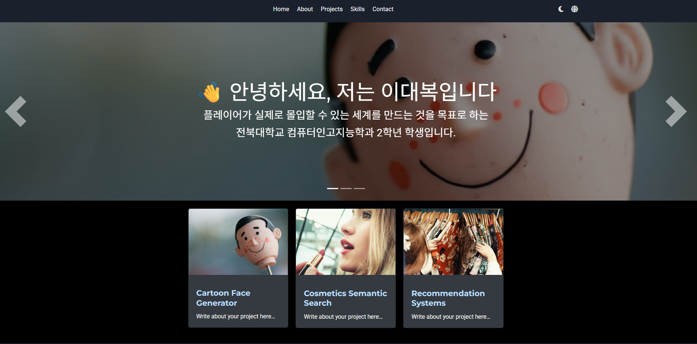

# [이대복 포트폴리오](https://rinda1234.github.io)

안녕하세요! 저는 전북대학교 **게임 디자인과 2학년 학생 이대복**입니다.  
이 사이트는 제가 개발한 프로젝트와 소프트웨어를 한눈에 보여주기 위한 포트폴리오 웹사이트입니다.  
Hugo와 HugoBlox 기반으로 제작되었으며, 맞춤형 위젯과 반응형 디자인을 적용했습니다 ⭐⭐⭐⭐⭐

## 🌐 사용 기술

- Hugo, HugoBlox  
- HTML, CSS, JS  
- GPT-4 API  
- GitHub Pages 배포

---

## 💬 소셜/연락처

- 이메일: daebok6962@jbnu.ac.kr  
- 전화: +82-10-5642-6962  
- Discord: [링크](https://discord.gg/TUy3pjPZe5)  
- GitHub: [rinda1234](https://github.com/rinda1234)  
- Instagram: [@daebok6962](https://instagram.com/daebok6962)  
- Facebook: [프로필](https://www.facebook.com/profile.php?id=100022542223459&sk=photos)  
- Solved.ac: [daebok6962](https://solved.ac/profile/daebok6962)

---

이 포트폴리오 사이트는 **Wowchemy**와 **Hugo**를 활용하여 제작되었습니다.  
원하는 위젯, 테마, 다국어 설정 등 모든 요소를 자유롭게 커스터마이징할 수 있습니다.
